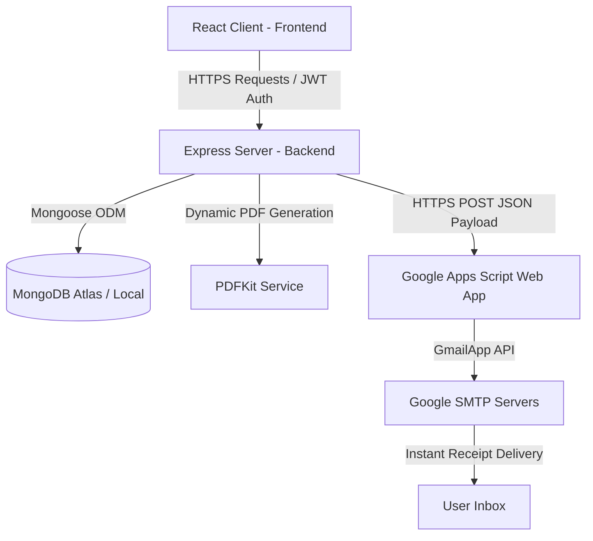

# 🛒 Rentora – Unified Buy & Rental Marketplace

[](https://rentora-beta.vercel.app/)
[](https://react.dev/)
[](https://nodejs.org/)
[](https://www.mongodb.com/)
[](https://tailwindcss.com/)

Rentora is a premium, full-stack **MERN (MongoDB, Express, React, Node.js)** web application that merges e-commerce purchasing and daily rental leasing within a single unified platform. Designed with sleek aesthetics, fluid state transitions, and a clean database design, Rentora provides users the option to either purchase products outright or rent them on daily budgets with automatic refundable security deposit calculations.

---

## 🔗 Live Deployment & Code Links

* **Live Frontend Client**: [https://rentora-beta.vercel.app/](https://rentora-beta.vercel.app/)
* **GitHub Repository**: [https://github.com/prasathr0811/Rentora-](https://github.com/prasathr0811/Rentora-)
* **Clone via SSH**: `git@github.com:prasathr0811/Rentora-.git`

---

## 🏗️ System Architecture



---

## 💡 Engineering Spotlights (Recruiter Interest)

### ⚡ 1. Google Apps Script HTTPS Email Dispatcher
* **Problem**: Cloud hosting services (such as Render on the Free Tier) block standard SMTP outbound traffic (ports 25, 465, 587) to prevent spam. Direct Gmail/Brevo SMTP connections will time out in production.
* **Solution**: Developed a serverless **Google Apps Script Web App** deployed on Google's infrastructure. The Node.js backend sends email payloads over HTTPS (port 443, not blocked) to the script. The script dynamically decodes PDF receipt attachments and dispatches the email natively using Google’s `GmailApp` API.
* **Benefit**: Achieved reliable, secure, and 100% free production email delivery from a real Gmail address, bypassing cloud hosting port blockages without incurring API costs.

### 📄 2. Dynamic PDF Invoice & Receipt Engine
* Uses `pdfkit` on the backend to dynamically generate stylized, branded PDF receipts containing transaction IDs, date timestamps, security deposits, and customized lease schedules.
* Receipts are stored temporarily and served via a protected route that supports instant browser viewing and printing.

### 🔄 3. Multi-Phase Simulated Payment Gateway
* Integrates a realistic checkout pipeline that performs validation, cart aggregation (handling mixed purchases/rentals), and triggers a 3-second multi-phase payment authorization visual loading indicator on the client before committing records to the database.

---

## 🚀 Key Features

* **Unified Catalog**: Each product card dynamically presents purchasing pricing, daily lease pricing, and a security deposit.
* **Smart Filter & Search**: Sidebar search with live text filtering, category/subcategory scoping, price range limits, and sorting by price/rating.
* **Wishlist System**: Fully persistent wishlist allowing users to save their favorite items for future rent/buy decisions.
* **Interactive Reviews & Ratings**: Rich user feedback loop supporting star ratings and detailed comments per product, with immediate average score re-calculations.
* **User Transaction Hubs**: 
  * **Orders Dashboard**: Tracks outright purchases, item details, and invoice links.
  * **Rentals Dashboard**: Tracks leasing statuses, rental duration, deposit amounts, start/end dates, and cancellation options.

---

## 🛠️ Tech Stack

| Layer | Technologies Used |
|---|---|
| **Frontend** | React.js, React Router DOM (v7), Context API (Auth, Cart), Axios, React Hot Toast |
| **Backend** | Node.js, Express.js, JWT, Bcrypt.js (password hashing) |
| **Database** | MongoDB & Mongoose ODM (Relational Schema references & indexing) |
| **Services** | Google Apps Script (Email delivery), PDFKit (PDF Receipt generation) |
| **Styling** | Tailwind CSS |

---

## 📂 Project Structure

```text
Rentora/
├── backend/
│   ├── config/          # Database connection configs
│   ├── controllers/     # API route handler functions (Auth, Orders, Rentals, Products, etc.)
│   ├── middleware/      # JWT verification and Error boundary handlers
│   ├── models/          # Mongoose models (User, Product, Order, Rental, Wishlist)
│   ├── routes/          # Express route declarations
│   ├── seeders/         # Data seeding scripts (populates 250+ products & demo users)
│   ├── services/        # Email dispatcher helper and PDFKit compiler
│   └── server.js        # Express application entry point
└── frontend/
    ├── src/
    │   ├── components/  # Reusable UI widgets (Cards, Loaders, Rating indicators)
    │   ├── context/     # Global state stores (Authentication & Shopping Cart contexts)
    │   ├── layouts/     # Root wrapping layouts
    │   ├── pages/       # Home, Catalog, Checkout, History Dashboards, Wishlist, Receipt View
    │   ├── services/    # Pre-configured Axios instance
    │   └── App.jsx      # Router configuration and global routes
```

---

## 🔧 Installation & Local Setup

### Prerequisites
* **Node.js** (v18+)
* **MongoDB** (running locally on port 27017 or a MongoDB Atlas URI)

### 1. Backend Setup
1. Navigate to the backend directory:
   ```bash
   cd backend
   ```
2. Install dependencies:
   ```bash
   npm install
   ```
3. Create a `.env` file inside the `backend` folder and populate it:
   ```env
   PORT=5000
   MONGO_URI=mongodb://127.0.0.1:27017/rentora
   JWT_SECRET=your_super_secret_jwt_key
   NODE_ENV=development
   SERVER_URL=http://localhost:5000
   
   # Setup GMAIL_SCRIPT_URL for email receipt delivery
   GMAIL_SCRIPT_URL=your_google_apps_script_web_app_url
   EMAIL_FROM=your_email@gmail.com
   ```
4. Run the seeder script to populate **250+ premium products** and demo accounts:
   ```bash
   npm run seed
   ```
5. Start the backend development server:
   ```bash
   npm start
   ```
   *Backend API runs on [http://localhost:5000](http://localhost:5000).*

### 2. Frontend Setup
1. Navigate to the frontend directory:
   ```bash
   cd ../frontend
   ```
2. Install dependencies:
   ```bash
   npm install
   ```
3. Start the Vite React development server:
   ```bash
   npm run dev
   ```
   *Frontend Client runs on [http://localhost:5173](http://localhost:5173).*

---

## 🔑 Demo Credentials

To test the application immediately, you can log in with these pre-seeded accounts:

* **Regular Buyer/Renter Account**:
  * **Email**: `demo@rentora.com`
  * **Password**: `123456`
* **Administrative Account**:
  * **Email**: `admin@rentora.com`
  * **Password**: `adminpassword`
